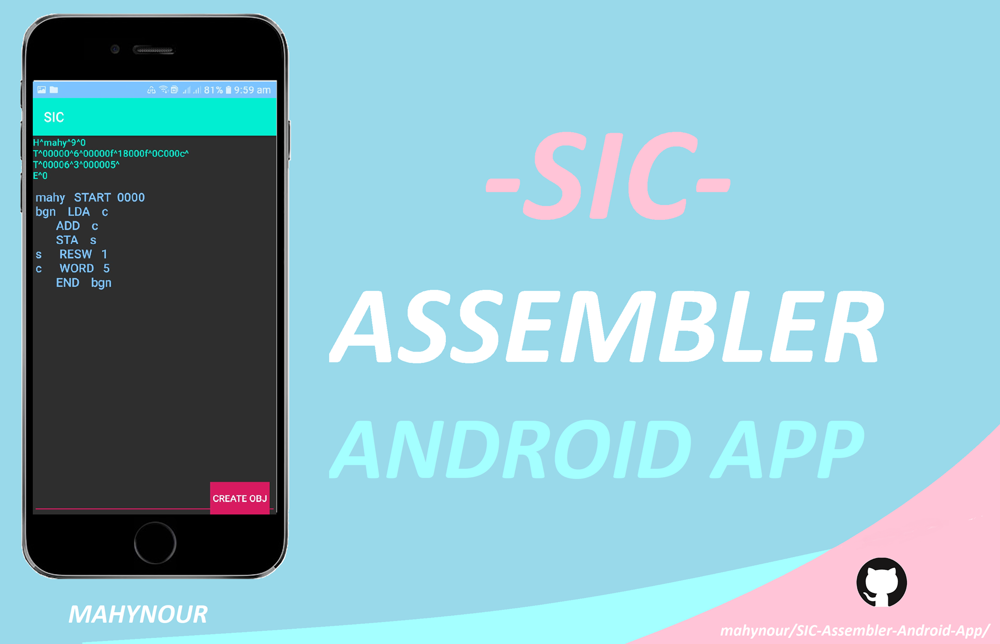
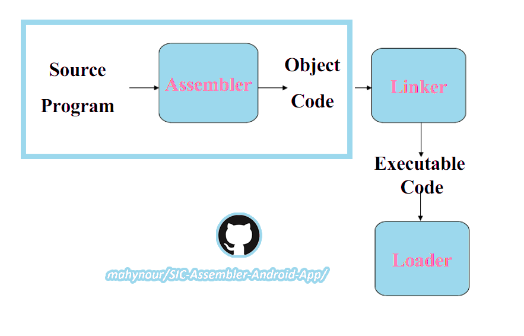

# SIC-Assembler-Android-App

# SIC Assembler App

Simplified Instructional Computer (SIC) 
is a tool to convert human language (source program) to machine code like fig below than pass to linker then from linker to loader

I provided this test as an android project 
to show the conversion from human language to machine language (object code) that done by the assembler

# Edge Cases
### ***user can :***
- write sic  instruction 
-  get error message if something wrong

